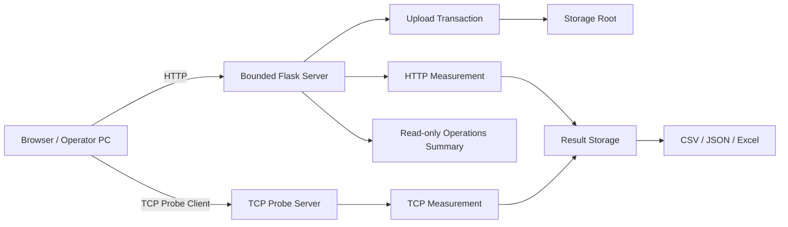
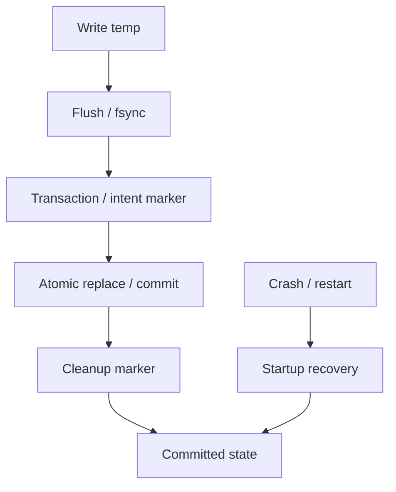

# Internal Network Transfer & Diagnostics

[](https://github.com/sebia1993/-/actions/workflows/stability-windows.yml)

**폐쇄망·사내 네트워크에서 파일을 전달하고, HTTP/TCP 처리량·지연·변동을 측정하며, 장시간 실행과 장애 복구까지 검증하는 Windows 네트워크 운영 보조 도구입니다.**

단순 파일 업로드 서버가 아니라 다음 두 문제를 함께 다룹니다.

1. 장애 분석에 필요한 PCAP·EVTX·문서·압축파일을 내부망에서 안전하게 전달
2. 같은 경로에서 HTTP와 별도 TCP probe를 이용해 실제 전송 성능과 변동을 측정

> 이 도구는 신뢰된 내부망 사용을 전제로 합니다. 사용자 인증이 없는 인터넷 공개 서비스, 장비 인벤토리, 장애 티켓 시스템, 원격 실행 플랫폼을 목표로 하지 않습니다.

## 한눈에 보기

| 영역 | 기능 |
|---|---|
| 파일 전달 | 브라우저 업로드 / 직접 다운로드 링크 / 메모 |
| 저장 경계 | 설정된 `STORAGE_ROOT` 하위만 허용 |
| 위험 파일 차단 | 실행파일·스크립트·바로가기·드라이버·설치 패키지·매크로 문서·디스크 이미지 차단 |
| PE 우회 방지 | 확장자와 별개로 Windows `MZ` 헤더 검사 |
| HTTP 측정 | 업/다운로드 처리량, 데이터량 또는 시간 기준 |
| TCP 측정 | 별도 TCP probe 서버/클라이언트로 전송 성능 측정 |
| 결과 | Mbps / MB/s / 변동률 / 1초 표본 / Excel·JSON·CSV |
| 동시성 | 웹 요청 최대 32, 업로드 최대 4, 측정 single-flight |
| 저장 안정성 | temp + fsync + atomic replace, transaction marker 기반 복구 |
| 디스크 보호 | 최소 여유공간 + 진행 중 업로드 용량 예약 |
| 종료 | bounded graceful shutdown 후 fail-closed 종료 |
| 장시간 검증 | Windows upload/TCP/restart soak + 자원 추세 분석 |
| 배포 | Windows self-contained ZIP, hash-pinned dependency, SHA-256/SBOM/security manifest |

## 해결하려 한 운영 문제

현장에서 파일 전달과 네트워크 품질 확인은 자주 같이 발생합니다. 예를 들어 로그·PCAP을 다른 PC로 옮겨야 하는데 전송 자체가 느리면 **파일 크기 문제인지, HTTP 경로 문제인지, 네트워크 자체의 처리량 문제인지** 구분해야 합니다.

이 프로젝트는 다음을 한 도구 안에서 분리해 관측합니다.

- 내부 파일 전달이 실제로 가능한가
- 브라우저 HTTP 업/다운로드의 처리량은 얼마인가
- 동일 경로에서 별도 TCP 측정 결과는 어떤가
- 평균 속도뿐 아니라 1초 단위 변동이 큰가
- 장시간 실행 중 CSV/JSON/업로드 transaction이 손상되지 않는가
- 프로세스 재시작이나 중간 실패 후 저장 상태가 일관되게 복구되는가

## 아키텍처



상세 구성요소와 상태 소유권은 [ARCHITECTURE.md](docs/ARCHITECTURE.md)를 참고하십시오.

## 네트워크 측정

### HTTP 전송 측정

브라우저와 서버 사이의 실제 HTTP 경로를 사용합니다.

**데이터량 기준**

- 10 / 50 / 100 / 500 / 1024MB
- 업로드 / 다운로드 / 양방향
- 평균 Mbps·MB/s
- 전송 시간과 1GB 예상 시간

**시간 기준**

- 워밍업 후 10초 또는 30초 본 측정
- 1초 단위 속도 표본
- 최근 3초 속도
- 평균·최저·최고·변동률
- 한 방향 실패 시 완료된 방향을 `부분 완료`로 보존
- 서버 전체에서 동시에 하나의 시간 기준 측정만 허용

### TCP 전송 성능 측정

HTTP 처리 계층과 별도로 TCP probe 서버/클라이언트를 사용해 전송 성능을 확인합니다.

```text
Operator PC
   ↓ dedicated TCP client
TCP probe port
   ↓
Server-side probe engine
   ↓
result JSON / CSV / Excel
```

HTTP와 TCP 결과를 함께 보면 브라우저·HTTP 애플리케이션 계층의 영향과 네트워크 전송 계층의 차이를 비교할 수 있습니다.

상세 측정 상태·partial result·single-flight 정책은 [MEASUREMENT_MODEL.md](docs/MEASUREMENT_MODEL.md)에 정리했습니다.

## 파일 전달 안전 경계

### 저장 경로

업로드 하위 경로는 `STORAGE_ROOT` 아래로만 제한합니다.

```text
허용: logs/2026/trace.pcap
차단: C:\temp\trace.pcap
차단: ..\..\trace.pcap
```

### 업로드 파일 정책

운영 보조 파일 전달을 목적으로 하므로 다음 계열은 차단합니다.

- 실행파일 / 스크립트 / 바로가기
- 드라이버 / 설치 패키지
- 매크로 포함 Office 문서
- 디스크 이미지
- 확장자를 바꾼 Windows PE 파일

PCAP, EVTX, 일반 문서와 ZIP 같은 압축파일은 전달할 수 있습니다. 단, **압축파일 내부 콘텐츠를 검사하는 보안 게이트웨이는 아닙니다.**

### 디스크·동시성 보호

- 서버에 최소 1GB 여유공간을 남김
- 진행 중 업로드의 아직 기록되지 않은 예상 용량도 예약량에 포함
- 업로드 중 주기적으로 실제 여유공간 재확인
- 업로드 동시 처리 최대 4
- 일반 웹 요청 worker 최대 32
- 처리 한도 초과는 503, 공간 부족은 507로 거절

## 장애 복구 설계

파일과 측정 결과는 단순 `write()` 후 성공으로 간주하지 않습니다.



업로드, sustained HTTP, TCP 결과에는 각각 transaction/intent와 startup recovery 경계가 있습니다. 모호한 상태를 정상 결과로 조용히 승격하지 않고, 복구 가능한 상태와 실패 상태를 구분합니다.

## bounded server와 종료 정책

대용량 파일 전송에 단순한 전체 요청 timeout을 적용하면 정상 요청을 잘못 끊을 수 있습니다. 그래서 서버는 **데이터가 흐르는 정상 전송과 아무 진행이 없는 연결을 구분**합니다.

- inactive connection 제한
- worker 상한
- 신규 요청 중단 후 진행 요청에 종료 grace 제공
- 종료 시 measurement 상태 정리
- bounded grace 이후에도 worker가 남으면 lock/진단 상태를 보존한 뒤 fail-closed 종료
- 다음 시작에서 transaction/CSV 무결성 복구

## Operations Summary

운영 화면에는 서버 상태와 최근 측정 결과를 요약해 보여주지만, 이는 **장비 인벤토리나 장애 티켓 시스템이 아닙니다.**

목적은 다음과 같습니다.

- 서버가 저장 가능한 상태인지
- TCP probe가 사용 가능한지
- 최근 HTTP/TCP 측정이 어떤 상태였는지
- 복구 또는 저장 오류가 있는지

## Windows 실행

일반 사용자는 GitHub Release의 Windows ZIP을 사용합니다.

```text
internal-upload_v0.5.3_windows.zip
```

1. ZIP을 완전히 압축 해제합니다.
2. `start_internal_upload.cmd`를 실행합니다.
3. 콘솔에 표시된 실제 HTTP 주소를 엽니다.
4. 다른 PC에서 사용할 경우 서버 PC의 허가된 내부 IP와 방화벽 정책을 확인합니다.

프로그램은 **Windows 방화벽을 자동 수정하거나 관리자 권한을 요구하지 않습니다.** 포트 허용이 필요하면 조직 정책에 따라 별도로 처리합니다.

## 주요 설정

```ini
[app]
CONFIG_VERSION=2
HOST=0.0.0.0
PORT=8000
BASE_URL=
STORAGE_ROOT=uploads
DELETE_ALLOWED_IPS=127.0.0.1,::1
RECENT_LIMIT=50

[network_probe]
ENABLED=true
PORT=5201
```

잘못된 설정을 임의 기본값으로 조용히 대체하지 않고 항목과 허용 범위를 안내한 뒤 종료합니다.

## 검증 체계

소스 검증은 Python·JavaScript·fault recovery를 함께 확인합니다.

```text
compileall
   ↓
JavaScript syntax check
   ↓
pytest regression suite
   ↓
stability fault suite
   ↓
pip dependency check
```

Windows 안정성 workflow는 별도로 upload/TCP/restart soak를 수행하고 자원 추세를 분석합니다. 기본 스케줄 검증은 45분입니다.

Release 빌드는 다음 보안·재현성 자료를 포함합니다.

- SHA-256
- SBOM
- security manifest
- security review
- hash-pinned Windows dependencies

자동 검증의 범위와 한계는 [VALIDATION_REPORT.md](docs/VALIDATION_REPORT.md)를 참고하십시오.

## 개발 검증

```powershell
python -m compileall app_version.py app.py bounded_server.py probe_client.py startup_ports.py runtime_stability.py upload_transactions.py measurement_transactions.py network_sustained.py sustained_excel.py excel_report.py network_measurement.py result_storage.py network_probe tests tools
node --check static/network_check.js
node --check static/network_sustained.js
node --check static/network_probe.js
node --check static/throughput_chart.js
node --check static/operations_dashboard.js
python -m pytest -q
python tools/run_stability_fault_suite.py
```

장시간 Windows 검증:

```powershell
python tools/run_windows_stability_soak.py --duration-minutes 45 --summary-path windows-soak-summary.json
python tools/analyze_windows_soak_summary.py windows-soak-summary.json --minimum-duration-minutes 45 --output windows-soak-analysis.json
```

개발 규칙은 [DEVELOPMENT.md](DEVELOPMENT.md)를 참고하십시오.

## 보안과 한계

이 프로젝트의 안전 경계는 [SECURITY_MODEL.md](docs/SECURITY_MODEL.md)에 자세히 정리했습니다.

주요 잔여 위험은 다음과 같습니다.

- 사용자 인증이 없는 신뢰 내부망 전제
- unsigned Windows binary
- 업로드 파일 크기 자체에는 고정 상한이 없음
- 압축파일 내부 콘텐츠는 검사하지 않음
- TCP client가 측정 완료를 기다리는 동안 장시간 연결될 수 있음

따라서 인터넷에 직접 노출하거나 불특정 사용자가 접근하는 환경을 대상으로 하지 않습니다.

## 문서

- [ARCHITECTURE.md](docs/ARCHITECTURE.md) — 구성요소와 데이터 흐름
- [MEASUREMENT_MODEL.md](docs/MEASUREMENT_MODEL.md) — HTTP/TCP 측정 모델
- [SECURITY_MODEL.md](docs/SECURITY_MODEL.md) — 파일·네트워크·저장 안전 경계
- [VALIDATION_REPORT.md](docs/VALIDATION_REPORT.md) — 자동 검증 범위와 한계
- [PROJECT_DIAGNOSTIC_AND_IMPROVEMENT_PLAN_KO.md](docs/PROJECT_DIAGNOSTIC_AND_IMPROVEMENT_PLAN_KO.md) — 상세 진단·개선 기록
- [CHANGELOG.md](CHANGELOG.md) — 버전 이력

## 범위 밖

- 인터넷 공개형 파일 공유 서비스
- 사용자/권한 관리 시스템
- 장비 인벤토리
- 장애 티켓 관리
- 업로드 파일 실행
- 방화벽 자동 변경
- 원격 명령 실행
