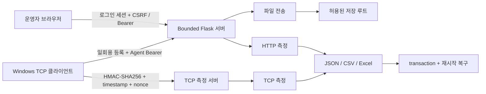

# Internal Network Transfer & Diagnostics

[](https://github.com/sebia1993/internal-network-transfer-diagnostics/actions/workflows/pr-validation.yml)
[](https://github.com/sebia1993/internal-network-transfer-diagnostics/actions/workflows/security.yml)
[](https://github.com/sebia1993/internal-network-transfer-diagnostics/actions/workflows/stability-windows.yml)

내부망에서 진단 파일을 전달하고, 같은 구간의 HTTP/TCP 전송 상태를 비교하는 Windows 운영 보조 도구입니다.

네트워크를 모르는 분에게는 이렇게 설명할 수 있습니다.

> “장애 분석 파일을 안전한 폴더 경계 안에서 전달하고, 전송이 느릴 때 웹 처리 문제인지 TCP 구간 문제인지 비교할 근거를 남기는 도구”

이 저장소는 장비를 제어하거나 회선 품질을 인증하지 않습니다. 파일 전송, 측정, 결과 보존, 재시작 복구와 배포 검증에 범위를 제한합니다.

## 포트폴리오 요약

| 질문 | 이 프로젝트가 보여주는 답 |
|---|---|
| 어떤 문제를 해결하는가? | 내부망 장애 분석 파일 전달과 전송 상태 확인을 한 화면에 묶었습니다. |
| 네트워크 전문성이 어디에 드러나는가? | HTTP와 별도 TCP 경로를 나눠 측정하고, 평균값뿐 아니라 1초 표본·변동·부분 실패를 보존합니다. |
| 운영 안정성은 어떻게 다루는가? | worker 상한, single-flight 측정, 디스크 예약, graceful shutdown, transaction 기반 재시작 복구를 적용했습니다. |
| 보안 경계는 무엇인가? | 비루프백 HTTP 인증·CSRF, TCP HMAC·재전송 방지, 저장 경로 제한, 위험 파일 차단을 적용했습니다. |
| 품질을 어떻게 증명하는가? | Windows CI, 회귀·장애 주입 테스트, 45분 합성 soak, CodeQL, secret scan, ZIP/SHA/SBOM 검증을 자동화했습니다. |

기술 스택: Python, Flask, TCP sockets, JavaScript, pytest, PowerShell, GitHub Actions, PyInstaller, CSV/JSON/Excel, CycloneDX

## 사용 흐름

1. 운영자가 Windows 서버를 실행합니다.
2. 같은 PC에서는 인증 없이 루프백 화면을 열 수 있습니다.
3. 다른 PC에서는 서버가 만든 접근 토큰으로 로그인합니다.
4. 진단 파일을 업로드하거나 HTTP 전송 측정을 실행합니다.
5. TCP 비교가 필요하면 화면에서 일회용 등록 토큰이 든 Windows 클라이언트 ZIP을 받습니다.
6. 결과를 화면, JSON, CSV 또는 Excel로 확인합니다.

화면별 역할과 합성 시나리오는 [UI 안내](docs/UI_WALKTHROUGH_KO.md)에 정리했습니다.

## 아키텍처



상세 책임과 상태 소유권은 [아키텍처 문서](docs/ARCHITECTURE.md)를 참고하세요.

## 주요 기능

### 파일 전달

- 브라우저 업로드와 직접 다운로드 링크
- `STORAGE_ROOT` 밖의 절대 경로·상위 경로 이동 차단
- 실행파일, 스크립트, 매크로 문서, 설치 패키지, 디스크 이미지 차단
- 확장자를 바꾼 Windows PE 파일의 `MZ` 헤더 검사
- 업로드 최대 4건, 일반 웹 worker 최대 32개
- 진행 중 요청을 포함한 디스크 공간 예약과 최소 여유공간 보호

### HTTP/TCP 비교 측정

- HTTP: 데이터량 또는 10/30초 시간 기준 업로드·다운로드 측정
- TCP: 전용 Windows 클라이언트와 별도 포트에서 1개 또는 4개 stream 측정
- 평균·최저·최고·변동과 1초 표본 저장
- 동시에 하나의 고부하 측정만 허용해 측정끼리 결과를 왜곡하지 않도록 제한
- 한 방향 실패 시 완료된 반대 방향 결과를 부분 완료로 보존

측정값의 의미는 [측정 모델](docs/MEASUREMENT_MODEL.md)에 설명했습니다.

### 실패 복구

파일과 결과를 단순히 쓴 뒤 성공으로 간주하지 않습니다.

```text
임시 파일 → flush/fsync → intent marker → atomic replace → marker 정리
                                 ↓ 중단
                         다음 시작에서 재조정
```

복구할 수 없는 모호한 상태는 정상으로 추정하지 않고 새 작업을 차단합니다.

## 인증과 비밀 관리

기본 설정 `HOST=0.0.0.0`에서는 루프백이 아닌 요청에 인증이 필요합니다.

- 브라우저: 접근 토큰 로그인 + cookie session + CSRF
- API 자동화: master Bearer token, cookie를 사용하지 않으므로 CSRF 면제
- TCP 등록: 짧은 수명의 1회용 enrollment token
- TCP 제어: agent/session별 HMAC-SHA256, 60초 시간 범위와 nonce 재사용 차단
- 접근 토큰: `INTERNAL_TRANSFER_ACCESS_TOKEN` 환경 변수 또는 소유자 전용 파일
- 금지: 토큰 값을 URL, CLI 인수, 로그, Git 저장 파일에 기록

최초 실행 시 기본 토큰 파일은 `data/.internal-transfer-access-token`에 만들어집니다. POSIX에서는 `0600`이 아니면 시작을 거부합니다. Windows에서는 파일을 서버 계정만 읽을 수 있는 위치와 ACL로 보호해야 합니다.

중요: 내장 HTTP/TCP는 암호화를 제공하지 않습니다. 인증은 무단 사용을 줄이지만 도청을 막지 못합니다. 신뢰할 수 있는 내부망·VPN에서 사용하고, 신뢰 경계를 넘으면 TLS 역방향 프록시를 적용하세요.

자세한 위협·제한·운영 조치는 [보안 모델](docs/SECURITY_MODEL.md)에 있습니다.

## Windows 실행

[GitHub Releases](https://github.com/sebia1993/internal-network-transfer-diagnostics/releases)에서 다음 자산을 받습니다.

```text
internal-upload_v0.6.0_windows.zip
internal-upload_v0.6.0_windows.zip.sha256
internal-upload_v0.6.0_sbom.cdx.json
```

1. SHA-256을 확인합니다.
2. ZIP을 완전히 압축 해제합니다.
3. `start_internal_upload.cmd`를 실행합니다.
4. 콘솔에 표시된 주소를 브라우저에서 엽니다.
5. 다른 PC에서는 서버의 접근 토큰 파일 값을 로그인 화면에 입력합니다.

프로그램은 Windows 방화벽을 자동 변경하거나 권한 상승을 요청하지 않습니다.

## 설정

```ini
[app]
CONFIG_VERSION=3
HOST=0.0.0.0
PORT=8000
BASE_URL=
STORAGE_ROOT=uploads
DELETE_ALLOWED_IPS=127.0.0.1,::1
RECENT_LIMIT=50

[network_probe]
ENABLED=true
PORT=5201

[security]
ACCESS_TOKEN_FILE=data/.internal-transfer-access-token
SESSION_TTL_MINUTES=480
ENROLLMENT_TOKEN_TTL_SECONDS=300
```

잘못된 명시 설정은 조용히 기본값으로 대체하지 않고 허용 범위를 안내한 뒤 시작을 중단합니다. `CONFIG_VERSION=2`에서 `3`으로 올라갈 때 사용자가 끈 TCP 측정 설정은 유지합니다.

## 검증

| 검증 | 실행 환경 | 확인하는 것 | 확인하지 못하는 것 |
|---|---|---|---|
| 회귀·장애 주입 | Windows CI와 로컬 개발 환경 | 라우트, 복구, 인증 실패, HMAC·replay, 파일/결과 무결성 | 실제 조직의 장비·보안 제품 호환성 |
| Windows 패키지 | GitHub-hosted Windows runner | EXE self-check, ZIP 구조, SHA, SBOM, security manifest | 코드 서명된 publisher 신원 |
| 45분 soak | GitHub-hosted Windows runner의 합성 파일/루프백 TCP | 업로드·TCP 자체 점검·재시작과 후처리, 자원 추세 | 현장 회선 속도, 장기 무중단 운영 전체 |
| CodeQL·secret scan | GitHub Actions | 알려진 코드 패턴과 추적 파일의 대표 비밀 형식 | 모든 취약점·모든 비밀 형식 |

Step Summary에는 크기가 제한된 Markdown만 게시하며, 원시 soak JSON과 분석 JSON은 workflow artifact로 보존합니다. 자동 검증의 판정 기준과 한계는 [검증 보고서](docs/VALIDATION_REPORT.md)에 있습니다.

## 로컬 개발 검증

```powershell
python -m compileall access_security.py app_version.py app.py bounded_server.py probe_client.py startup_ports.py runtime_stability.py upload_transactions.py measurement_transactions.py network_sustained.py sustained_excel.py excel_report.py network_measurement.py result_storage.py network_probe tests tools
node --check static/security.js
node --check static/network_check.js
node --check static/network_sustained.js
node --check static/network_probe.js
node --check static/throughput_chart.js
node --check static/operations_dashboard.js
python -m pytest -q
python tools/scan_tracked_secrets.py
python tools/run_stability_fault_suite.py
python -m pip check
```

Windows 합성 soak:

```powershell
python tools/run_windows_stability_soak.py --duration-minutes 45 --summary-path windows-soak-summary.json
python tools/analyze_windows_soak_summary.py windows-soak-summary.json --minimum-duration-minutes 45 --output windows-soak-analysis.json
python tools/render_windows_soak_summary.py --summary windows-soak-summary.json --analysis windows-soak-analysis.json --output windows-soak-step-summary.md
```

## 알려진 한계

- 인터넷 공개형·다중 사용자 파일 공유 서비스가 아닙니다.
- HTTP/TCP 데이터 기밀성을 제공하지 않습니다.
- Windows EXE는 코드 서명되지 않았습니다.
- 업로드 전체 크기의 고정 상한과 압축파일 내부 검사는 없습니다.
- 측정값은 endpoint·OS·브라우저·경로의 영향을 함께 받는 관측값이며 회선 SLA 판정이 아닙니다.
- UDP 손실·지터, 장비 인벤토리, 장애 티켓, 원격 명령 실행은 범위 밖입니다.
- 합성 CI 자료는 실제 현장 성과 수치가 아닙니다.

## 문서

- [아키텍처](docs/ARCHITECTURE.md)
- [UI 안내와 합성 시나리오](docs/UI_WALKTHROUGH_KO.md)
- [측정 모델](docs/MEASUREMENT_MODEL.md)
- [보안 모델](docs/SECURITY_MODEL.md)
- [검증 보고서](docs/VALIDATION_REPORT.md)
- [v0.5.x 진단·개선 기록](docs/PROJECT_DIAGNOSTIC_AND_IMPROVEMENT_PLAN_KO.md)
- [개발 가이드](DEVELOPMENT.md)
- [변경 이력](CHANGELOG.md)
- [릴리스 준비 기록](RELEASE_NOTES.md)

## 라이선스

[MIT License](LICENSE)
