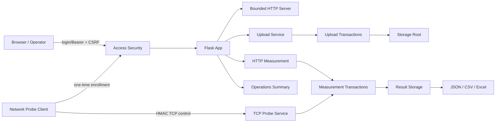

# Internal Network Transfer & Diagnostics 아키텍처

## 목적

이 프로젝트는 하나의 Windows 서버 프로세스에서 **내부 파일 전달**, **HTTP 처리량 측정**, **별도 TCP probe 측정**, **운영 상태 요약**을 제공하되, 각 기능의 상태와 실패를 분리해 관리합니다.

## 구성요소



## 주요 모듈

### `app.py`

Flask route, 설정 로딩, 파일 업로드/다운로드/삭제, 네트워크 측정 API와 단일 페이지 UI 진입점을 담당합니다.

### `access_security.py`

비루프백 HTTP 인증, cookie session·CSRF, 접근 token 파일, 일회용 Windows client 등록 token을 담당합니다. token 값은 로그·URL·CLI에 전달하지 않습니다.

### `bounded_server.py`

무제한 thread/request 증가를 허용하지 않는 HTTP 실행 경계입니다. worker 수와 inactive connection 시간을 제한하고 정상적으로 데이터가 계속 흐르는 대용량 전송과 정지된 연결을 구분합니다.

### `upload_transactions.py`

업로드·삭제와 관련된 durable marker를 관리하고, 중간 실패 또는 프로세스 재시작 후 파일 상태를 재조정합니다.

### `network_sustained.py`

시간 기준 HTTP 측정 세션의 상태, 워밍업/본 측정, 1초 표본, 취소, partial completion과 결과 저장을 담당합니다.

### `network_measurement.py`

HTTP/TCP 측정 간 공유되는 single-flight 실행 경계를 제공합니다. 동시에 여러 고부하 측정이 시작되어 서로의 결과를 왜곡하는 것을 막습니다.

### `network_probe/`

HTTP 애플리케이션 계층과 분리된 TCP 측정 경로입니다. protocol `v3` HMAC, timestamp/nonce replay 방지, server, agent/client 상태, 통계, Windows telemetry, Excel 결과와 self-check를 포함합니다.

### `measurement_transactions.py`

HTTP sustained/TCP 측정 결과의 intent/commit 상태를 관리합니다. JSON 결과와 CSV 인덱스 간 불일치를 startup recovery에서 재조정합니다.

### `result_storage.py`

결과 JSON을 임시 파일에 쓰고 flush/fsync 후 atomic replace하는 저장 경계를 제공합니다.

### `runtime_stability.py`

데이터 디렉터리 instance lock, CSV tail recovery, 진단 로그 rotation, 저장소 health 확인을 담당합니다.

## 상태 소유권

| 상태 | 위치 | 특성 |
|---|---|---|
| 업로드 파일 | `STORAGE_ROOT` | 운영 데이터, Git 비대상 |
| 업로드 메타데이터 | CSV | 초기 header만 source에 포함 |
| HTTP 측정 결과 | JSON + CSV | transaction recovery 대상 |
| TCP 측정 결과 | JSON + CSV | transaction recovery 대상 |
| Excel | 요청 시 생성 | 원본 상태의 authoritative store가 아님 |
| server instance lock | data directory | 동일 data root 중복 실행 방지 |
| diagnostics | rotating log | bounded 운영 진단 |

## 실패 격리

- TCP probe가 비활성/포트 충돌 상태여도 파일 업로드와 HTTP 측정은 계속 제공할 수 있습니다.
- 한 방향 HTTP 측정이 실패해도 이미 완료된 반대 방향 결과를 `부분 완료`로 보존할 수 있습니다.
- 파일 저장 실패는 임시 파일 정리와 transaction recovery로 격리합니다.
- operations summary는 authoritative inventory가 아니라 현재 저장/측정 상태를 읽기 전용으로 투영합니다.

## 프로세스 종료

```text
신규 요청 중단
    ↓
진행 중 요청 grace
    ↓
느린 소켓 종료 요청
    ↓
측정 상태 실패/취소 정리
    ↓
진단/저장 상태 flush
    ↓
정상 종료 또는 bounded fail-closed 종료
```

무한 대기 대신 제한된 종료 시간을 두고, 비정상 종료 후 다음 시작에서 transaction 및 CSV 상태를 재검증합니다.
